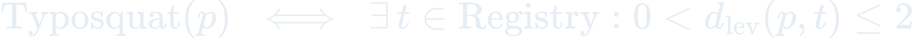

# The Science Behind Hydra

Formal mathematical models powering every security engine in Hydra.

These aren't abstractions. Every formula maps to running code.

---

## R1. Aho-Corasick Pattern Engine

**Problem:** Scan text T for 200+ secret patterns P in linear time.

Construction: build a trie from all patterns, add failure links via BFS, then scan text following goto/failure/output functions.

The hook (`scan-secrets.sh`) uses `grep -nEo` with cached regex alternation for <50ms real-time scanning. The Python implementation (`shared/scripts/pattern-engine.py`) builds the full automaton for batch scanning.

**Implementation:** `plugins/secret-scanner/hooks/post-tool-use/scan-secrets.sh`, `shared/scripts/pattern-engine.py`

---

## R2. Shannon Entropy Analysis

**Problem:** Detect high-entropy strings that look like secrets but don't match known patterns.

 4.5 AND length >= 20">

Excludes known false positives: UUIDs, lock file hashes, pure alphabetic strings. Severity escalates with entropy: H > 5.0 is HIGH, H > 4.5 is MEDIUM.

**Implementation:** `shared/scripts/entropy-analyzer.py`

---

## R3. OWASP Vulnerability Graph

**Problem:** Detect CWE-mapped vulnerability patterns with language awareness.

Maps to OWASP Top 10 2021 categories. Language detection from file extension filters applicable patterns. Comment detection reduces false positives.

| OWASP | CWE | Detection |
|-------|-----|-----------|
| A01 | CWE-22 | Path traversal with user input |
| A02 | CWE-327, CWE-338 | Weak crypto, insecure random |
| A03 | CWE-78, CWE-79, CWE-89 | Command/XSS/SQL injection |
| A05 | CWE-346 | CORS wildcard |
| A07 | CWE-798 | Hardcoded credentials |
| A08 | CWE-502 | Insecure deserialization |
| A10 | CWE-918 | SSRF |

**Implementation:** `plugins/vuln-detector/hooks/post-tool-use/detect-vuln.sh`, `shared/scripts/vuln-scanner.py`

---

## R4. Markov Action Classification

**Problem:** Classify Bash commands as safe, risky, or dangerous before execution.

In `strict` mode, both BLOCK and WARN patterns are blocked. In `balanced` mode (default), only BLOCK patterns are blocked. In `permissive` mode, nothing is blocked.

**Implementation:** `plugins/action-guard/hooks/pre-tool-use/guard-action.sh`

---

## R5. Config Poisoning Detection

**Problem:** Detect malicious repository config files before they execute.

Covers: CVE-2025-59536 (hooks exploit), CVE-2026-21852 (API key theft), CVE-2025-54135 (Cursor MCP), plus VSCode autorun, MCP consent bypass, package.json lifecycle scripts, hidden Unicode injection.

Deep analysis decodes base64 payloads and detects obfuscated commands.

**Implementation:** `plugins/config-shield/hooks/session-start/scan-config.sh`, `shared/scripts/config-scanner.py`

---

## R6. Phantom Dependency Detection

**Problem:** Detect AI-hallucinated package names (slopsquatting) via edit distance.

Cross-references against known hallucinated packages and popular package names. Checks npm, PyPI, Cargo, Go ecosystems.

**Implementation:** `shared/scripts/supply-chain.py`

---

## R7. Subcommand Overflow Detection

**Problem:** Commands with 50+ subcommands bypass deny rules silently.

 50">

Discovered by Adversa AI: when a command contains enough subcommands, safety filters fail to evaluate all of them. Hydra counts subcommand parts before any pattern matching.

**Implementation:** `plugins/action-guard/hooks/pre-tool-use/guard-action.sh`

---

## R8. EMA Posture Decay

**Problem:** Track security posture across sessions with exponential moving average.

Accumulates per-finding-type rates across sessions. Patterns frequently dismissed get lower severity. Chronic patterns (rate > 0.5 across 3+ sessions) are flagged.

**Implementation:** `shared/scripts/learnings.py`

---

*Every formula maps to executable code in the enchanted-plugins ecosystem. The math runs.*
